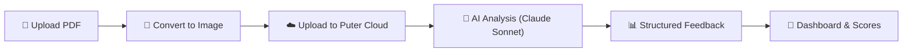

<p align="center">
  
</p>

<h1 align="center">ResumeIQ — AI-Powered Resume Analyzer</h1>

<p align="center">
  <strong>Upload your resume. Get instant AI feedback. Land more interviews.</strong>
</p>

<p align="center">
  <a href="https://ai-resume-analyzer-beige-rho.vercel.app/">
    
  </a>
  &nbsp;
  
  
  
  
  
  
</p>

<p align="center">
  <a href="#-features">Features</a> •
  <a href="#-how-it-works">How It Works</a> •
  <a href="#%EF%B8%8F-tech-stack">Tech Stack</a> •
  <a href="#-getting-started">Getting Started</a> •
  <a href="#-project-structure">Project Structure</a> •
  <a href="#-deployment">Deployment</a> •
  <a href="#-license">License</a>
</p>

---

## 📸 Screenshots

<p align="center">
  
</p>

<details>
<summary><strong>🖼️ More Screenshots</strong></summary>
<br />

| Upload & Analyze | AI Feedback Report |
|:-:|:-:|
|  |  |

</details>

---

## ✨ Features

| Feature | Description |
|:--|:--|
| 🤖 **AI Resume Analysis** | Powered by Claude Sonnet via Puter.js — get deep, contextual feedback on your resume |
| 📊 **ATS Score** | See how your resume performs against Applicant Tracking Systems with a 0–100 score |
| 🎯 **Job-Specific Feedback** | Provide a job title & description to get tailored recommendations |
| 📝 **Multi-Category Scoring** | Detailed scores across **ATS**, **Content**, **Structure**, **Skills**, and **Tone & Style** |
| ✅ **Actionable Tips** | Every category includes "good" and "improve" suggestions with detailed explanations |
| 📄 **PDF Parsing** | Client-side PDF-to-image conversion using `pdfjs-dist` — no server processing needed |
| 🔐 **User Authentication** | Seamless sign-in via Puter.js auth with persistent user sessions |
| 💾 **Cloud Storage** | Resumes stored in Puter.js cloud filesystem — access your analyses from anywhere |
| 📱 **Fully Responsive** | Optimized for desktop, tablet, and mobile viewports |
| 🐳 **Docker Ready** | Multi-stage Dockerfile included for containerized deployments |

---

## 🔄 How It Works



1. **Upload** — Drag & drop or select your resume PDF
2. **Convert** — The PDF is converted to an image client-side using `pdfjs-dist`
3. **Store** — Both the PDF and the image are uploaded to your Puter.js cloud storage
4. **Analyze** — The resume is sent to Claude Sonnet with a structured prompt requesting JSON feedback
5. **Review** — View your overall score, ATS compatibility, and detailed category breakdowns with tips

---

## 🛠️ Tech Stack

| Layer | Technology | Purpose |
|:--|:--|:--|
| **Framework** | [React Router v7](https://reactrouter.com/) | Full-stack React framework with SSR support |
| **UI Library** | [React 19](https://react.dev/) | Component-based UI |
| **Language** | [TypeScript 5](https://www.typescriptlang.org/) | Type-safe development |
| **Styling** | [Tailwind CSS v4](https://tailwindcss.com/) | Utility-first CSS |
| **State Management** | [Zustand 5](https://zustand.docs.pmnd.rs/) | Lightweight global state |
| **AI Backend** | [Puter.js](https://puter.com/) | Auth, cloud FS, KV storage, and AI (Claude Sonnet) |
| **PDF Processing** | [pdf.js](https://mozilla.github.io/pdf.js/) | Client-side PDF rendering & image conversion |
| **File Upload** | [react-dropzone](https://react-dropzone.js.org/) | Drag-and-drop file uploads |
| **Build Tool** | [Vite 6](https://vite.dev/) | Lightning-fast HMR & bundling |
| **Deployment** | [Vercel](https://vercel.com/) | Edge-optimized hosting |

---

## 🚀 Getting Started

### Prerequisites

- **Node.js** ≥ 20
- **npm** ≥ 9

### Installation

```bash
# 1. Clone the repository
git clone https://github.com/dhanal-yuvraj/AI-Resume-Analyzer.git
cd AI-Resume-Analyzer

# 2. Install dependencies
npm install

# 3. Start the development server
npm run dev
```

The app will be available at **`http://localhost:5173`**.

### Available Scripts

| Command | Description |
|:--|:--|
| `npm run dev` | Start development server with HMR |
| `npm run build` | Build for production |
| `npm run start` | Serve the production build |
| `npm run typecheck` | Run TypeScript type checking |

---

## 📁 Project Structure

```
AI-Resume-Analyzer/
├── app/
│   ├── components/          # Reusable UI components
│   │   ├── ATS.tsx          # ATS score card with suggestions
│   │   ├── Accordion.tsx    # Expandable feedback sections
│   │   ├── Details.tsx      # Detailed category breakdowns
│   │   ├── FileUploader.tsx # Drag-and-drop PDF uploader
│   │   ├── Navbar.tsx       # Navigation bar
│   │   ├── ResumeCard.tsx   # Resume preview card for dashboard
│   │   ├── ScoreBadge.tsx   # Color-coded score indicator
│   │   ├── ScoreCircle.tsx  # Circular score visualization
│   │   ├── ScoreGauge.tsx   # Gauge-style score meter
│   │   └── Summary.tsx      # Overall score summary
│   ├── lib/
│   │   ├── pdf2img.ts       # PDF-to-image conversion utility
│   │   ├── puter.ts         # Puter.js Zustand store (auth, fs, ai, kv)
│   │   └── utils.ts         # Helper utilities (UUID generation)
│   ├── routes/
│   │   ├── auth.tsx         # Authentication page
│   │   ├── home.tsx         # Resume dashboard
│   │   ├── resume.tsx       # Individual resume analysis view
│   │   ├── upload.tsx       # Resume upload & analysis form
│   │   └── wipe.tsx         # Data management / reset
│   ├── app.css              # Global styles
│   ├── root.tsx             # App root layout with Puter.js init
│   └── routes.ts            # Route configuration
├── constants/
│   └── index.ts             # AI prompt templates & response schemas
├── types/
│   ├── index.d.ts           # Resume & Feedback type definitions
│   └── puter.d.ts           # Puter.js type declarations
├── public/                  # Static assets (icons, images, backgrounds)
├── Dockerfile               # Multi-stage Docker build
├── tailwind.config.ts       # Tailwind CSS configuration
├── vite.config.ts           # Vite build configuration
└── package.json
```

---

## 🐳 Docker

Build and run with Docker:

```bash
# Build the image
docker build -t resumeiq .

# Run the container
docker run -p 3000:3000 resumeiq
```

The app uses a multi-stage build for optimized image size:
- **Stage 1** — Install all dependencies
- **Stage 2** — Install production dependencies only
- **Stage 3** — Build the application
- **Stage 4** — Minimal runtime image

---

## 🌐 Deployment

### Vercel (Recommended)

1. Push your code to GitHub
2. Import the repository on [vercel.com](https://vercel.com)
3. Vercel auto-detects the React Router framework — no extra config needed
4. Deploy 🚀

### Other Platforms

The app builds to a standard Node.js server. Deploy anywhere that supports Node.js:

```bash
npm run build
npm run start
```

---

## 📊 AI Analysis Categories

ResumeIQ evaluates resumes across **5 key dimensions**, each scored 0–100:

| Category | What It Measures |
|:--|:--|
| **🤖 ATS Compatibility** | Keyword optimization, formatting for parsing, standard section headers |
| **📝 Content Quality** | Impact of bullet points, quantified achievements, relevance to role |
| **🏗️ Structure & Layout** | Section organization, visual hierarchy, readability |
| **💡 Skills Alignment** | Match between listed skills and job requirements |
| **🎨 Tone & Style** | Professional language, consistency, action verb usage |

---

## 🔑 Key Technical Highlights

- **Zero Backend** — The entire app runs client-side with Puter.js handling auth, storage, and AI
- **No API Keys Required** — Puter.js provides free access to Claude Sonnet — no OpenAI/Anthropic keys needed
- **Privacy-First** — Resumes are stored in the user's own Puter cloud space, not on any shared server
- **Type-Safe AI Responses** — Structured TypeScript interfaces ensure consistent AI output parsing
- **Optimized PDF Pipeline** — Client-side PDF → image conversion eliminates server-side processing costs

---

## 🤝 Contributing

Contributions are welcome! Here's how to get started:

1. **Fork** the repository
2. **Create** a feature branch (`git checkout -b feature/amazing-feature`)
3. **Commit** your changes (`git commit -m 'Add amazing feature'`)
4. **Push** to the branch (`git push origin feature/amazing-feature`)
5. **Open** a Pull Request

---

## 📄 License

This project is open source and available under the [MIT License](LICENSE).

---

<p align="center">
  <strong>Built with ❤️ by <a href="https://github.com/dhanal-yuvraj">Yuvraj Dhanal</a></strong>
</p>

<p align="center">
  <a href="https://ai-resume-analyzer-beige-rho.vercel.app/">Live Demo</a> •
  <a href="https://github.com/dhanal-yuvraj/AI-Resume-Analyzer/issues">Report Bug</a> •
  <a href="https://github.com/dhanal-yuvraj/AI-Resume-Analyzer/issues">Request Feature</a>
</p>
